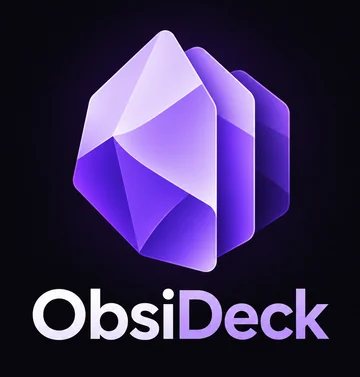
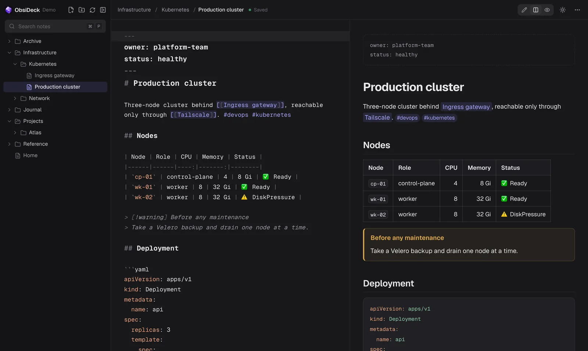
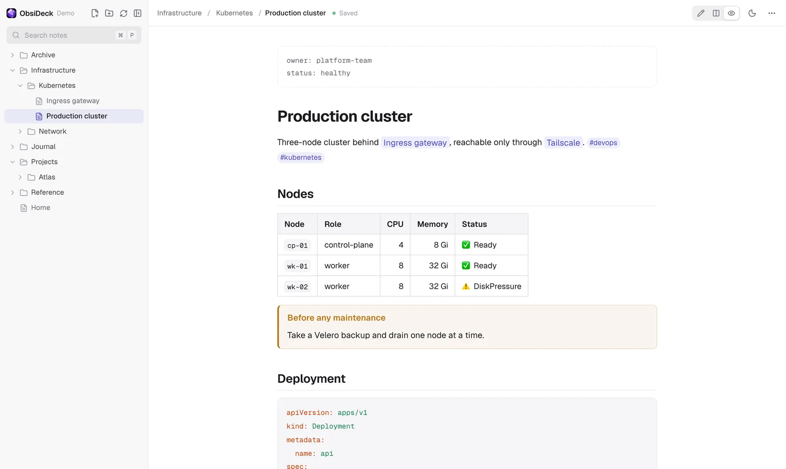
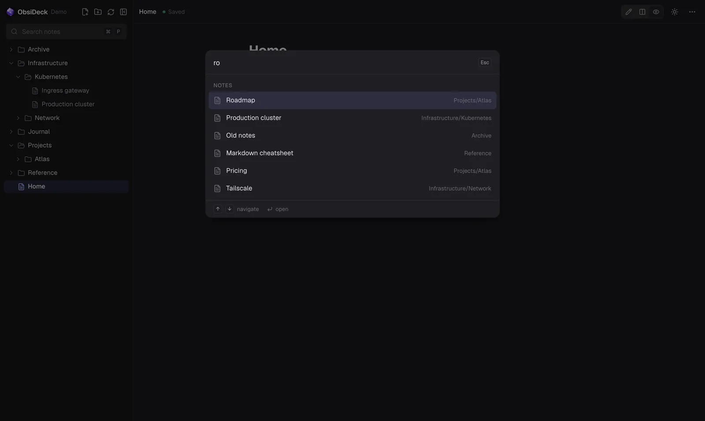

<p align="center">
  
</p>

<p align="center">
  <strong>Your Obsidian vault, in the browser. Self-hosted, local files only.</strong>
</p>

<p align="center">
  <a href="https://github.com/OPS-NC/ObsiDeck/actions/workflows/ci.yml"></a>
  <a href="https://github.com/OPS-NC/ObsiDeck/pkgs/container/obsideck"></a>
  <a href="LICENSE"></a>
</p>

<p align="center">
  
</p>

ObsiDeck is a web editor for an Obsidian vault that lives on your machine. It reads and writes your Markdown files directly — no database, no sync service, no import step — so Obsidian and ObsiDeck can work on the same folder at the same time.

It is built to be reached privately from your other devices (laptop, iPad, phone) through [Tailscale](https://tailscale.com), behind an Envoy gateway, under a single path such as `https://<machine>.<tailnet>.ts.net/obsideck`.

## Features

- **Real editor** — CodeMirror 6 with Markdown highlighting, code-block languages, search in note, multi-cursor, `[[` note autocompletion.
- **Edit, Split, Preview** — notes open in preview; split view keeps both panes scroll-synced.
- **Obsidian syntax** — `[[links]]`, `[[note|alias]]`, `[[note#heading]]`, `![[image.png]]`, `#tags`, `==highlights==`, callouts, frontmatter, GitHub Flavored Markdown (tables, task lists, footnotes).
- **Safe saving** — autosave, atomic writes (temp file + fsync + rename), per-file write ordering, conflict detection with version hashes.
- **Live sync with Obsidian** — a filesystem watcher pushes changes over Server-Sent Events. Edits made elsewhere reload instantly; if you have unsaved edits you choose between *Reload from disk* and *Keep my version*. Nothing is ever overwritten silently.
- **Fast navigation** — virtualized file tree for large vaults, fuzzy quick open (`⌘P`), command palette (`⌘⇧P`), full-text search with highlighted snippets.
- **File management** — create, rename and delete notes and folders. Deleting moves items to the vault's `.trash` folder, like Obsidian.
- **Polished UI** — dark and light themes (follows the system, remembers your choice), responsive layout with a mobile drawer.

<table>
  <tr>
    <td></td>
    <td></td>
  </tr>
  <tr>
    <td align="center"><sub>Preview, light theme</sub></td>
    <td align="center"><sub>Quick open (⌘P)</sub></td>
  </tr>
</table>

## Quick start

Requirements: Docker with Compose v2 (Docker Desktop, OrbStack or Docker Engine), and Tailscale for remote access.

```bash
git clone https://github.com/OPS-NC/ObsiDeck.git
cd ObsiDeck
cp .env.example .env
# Edit .env and set OBSIDIAN_VAULT_HOST_PATH to your vault folder.
docker compose up -d
```

Open <http://127.0.0.1:8088/obsideck>. The prebuilt image (`linux/amd64`, `linux/arm64`) is pulled from GitHub Container Registry: nothing is built on your machine.

```bash
docker compose ps        # both containers should be "healthy"
docker compose logs -f   # Envoy writes one access-log line per request
docker compose pull && docker compose up -d   # update to the latest image
docker compose down
```

> [!IMPORTANT]
> **macOS + iCloud vaults.** A vault stored in iCloud Drive (`~/Library/Mobile Documents/iCloud~md~obsidian/Documents`) is protected by macOS privacy controls. Grant **Full Disk Access** to Docker Desktop or OrbStack (*System Settings → Privacy & Security*), then restart it. Without it, every file access from the container blocks. Also mark the vault folder as *Keep Downloaded* so iCloud does not evict files.

## Remote access with Tailscale

Tailscale Serve terminates HTTPS with a valid `*.ts.net` certificate and forwards to Envoy. It is only reachable by devices in your tailnet.

```bash
tailscale serve --bg --set-path /obsideck http://127.0.0.1:8088/obsideck
tailscale serve status
```

ObsiDeck is then available at `https://<machine>.<tailnet>.ts.net/obsideck`. Only the `/obsideck` path is used, so other services already served on the same machine are not affected. To remove it:

```bash
tailscale serve --https=443 --set-path /obsideck off
```

> [!CAUTION]
> Do not expose ObsiDeck with `tailscale funnel` or any public reverse proxy. It has no login of its own: access control is delegated to your tailnet.

## Configuration

All settings live in `.env` (see [`.env.example`](.env.example)).

| Variable | Default | Description |
| --- | --- | --- |
| `OBSIDIAN_VAULT_HOST_PATH` | *required* | Vault folder on the host, mounted at `/vault` in the container. |
| `OBSIDECK_VERSION` | `latest` | Image tag: `latest` (main branch) or a release such as `0.1`. |
| `OBSIDECK_HTTP_PORT` | `8088` | Port published by Envoy, bound to `127.0.0.1` only. |
| `OBSIDECK_VAULT_NAME` | `Obsidian` | Name shown in the sidebar. |
| `OBSIDECK_UID` / `OBSIDECK_GID` | `1000` | User the app runs as. On Linux, use the vault owner's ids (`id -u`, `id -g`). |
| `OBSIDECK_WATCH_POLLING` | `false` | Poll the filesystem when change events are not propagated into the container. |
| `OBSIDECK_POLL_INTERVAL` | `1000` | Polling interval in milliseconds. |
| `OBSIDECK_BASE_PATH` | `/obsideck` | URL prefix. Baked into the build: a different value requires building from source. |

### Building from source

Needed only for a custom URL prefix or local changes:

```bash
docker compose -f docker-compose.yml -f docker-compose.build.yml up -d --build
```

When changing `OBSIDECK_BASE_PATH`, update the routes in [`infra/envoy/envoy.yaml`](infra/envoy/envoy.yaml) as well.

## How it works

```text
Browser ── HTTPS ──▶ Tailscale Serve (host)
                        └─▶ 127.0.0.1:8088  Envoy  (container, only published port)
                                └─▶ obsideck:3000  Next.js app  (internal Docker network, no internet access)
                                        └─▶ /vault  bind mount of your Obsidian folder
```

- **App** — Next.js 16 (App Router, standalone output) serves both the UI and a small JSON API. The vault folder is the only source of truth; contents are loaded on demand and the tree carries metadata only.
- **Envoy** — routes `/obsideck/*` to the app, redirects `/` to `/obsideck`, keeps the SSE stream open, forwards `X-Forwarded-For/-Proto/-Host`, and rejects unknown `Host` headers.
- **Watcher** — chokidar watches the vault, batches events and streams them to the browser, which refreshes the tree and the open note.

### Security model

ObsiDeck gives a browser write access to a folder on your disk, so the API is deliberately narrow:

- Every client path goes through a single gateway ([`lib/security/vault.ts`](lib/security/vault.ts)). Paths are vault-relative only; `..`, absolute paths, backslashes, control characters and hidden entries (`.obsidian`, `.git`, `.trash`) are rejected.
- Both the parent folder and the target are resolved with `realpath` and must stay inside the vault, so symlinks cannot be used to escape it.
- The note API only accepts `.md` files; the attachment endpoint only serves whitelisted image types (SVG with a sandboxing CSP).
- Creation never overwrites, rename refuses existing targets, delete moves to `.trash`.
- Mutating requests require `application/json` and a same-origin `Sec-Fetch-Site` (CSRF). Envoy only accepts `*.ts.net`, `localhost` and `127.0.0.1` hosts (DNS rebinding).
- The app container runs as non-root with a read-only root filesystem, no Linux capabilities and no outbound network.

These rules are covered by the test suite (`npm test`), which also runs during every image build.

## Keyboard shortcuts

| Shortcut | Action |
| --- | --- |
| `⌘/Ctrl P` | Quick open (type `>` for commands) |
| `⌘/Ctrl ⇧ P` | Command palette |
| `⌘/Ctrl N` or `Alt N` | New note |
| `⌘/Ctrl S` | Save now |
| `⌘/Ctrl F` | Find in note |
| `⌘/Ctrl B` / `I` | Bold / italic |
| `⌘/Ctrl \` | Toggle sidebar |
| `⌘/Ctrl ⌥ 1 / 2 / 3` | Edit / Split / Preview |
| `F2` / `Delete` in the tree | Rename / delete |

Browsers reserve `⌘N` for a new window; use `Alt N`, or install ObsiDeck as an app from Chrome so the shortcut reaches the page.

## Development

```bash
npm install
OBSIDIAN_VAULT_PATH=/path/to/a/test/vault npm run dev   # http://localhost:3000/obsideck
npm test            # Vitest: path security, filesystem operations, Markdown rendering
npm run typecheck
npm run build
```

Use a copy of a vault while developing: the app writes to real files.

Stack: Next.js 16, React 19, TypeScript (strict), Tailwind CSS 4, Radix UI, cmdk, CodeMirror 6, react-markdown (remark/rehype), chokidar, Zod, Zustand, Vitest.

## Limitations

- Renaming a note does not rewrite the `[[links]]` pointing to it.
- Note embeds (`![[Note]]`) render as links, not transclusions. No Obsidian plugins (Dataview, Canvas), Mermaid or LaTeX.
- Only `.md` files are listed; other files are served only as images referenced by notes.
- No drag and drop in the file tree.
- No built-in authentication: run it on a private network only.

## License

[MIT](LICENSE)
